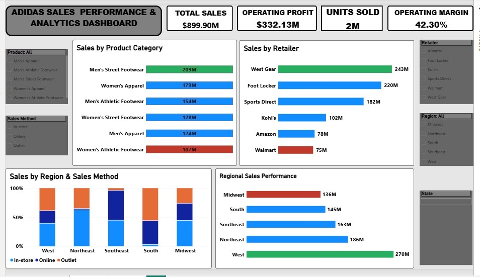
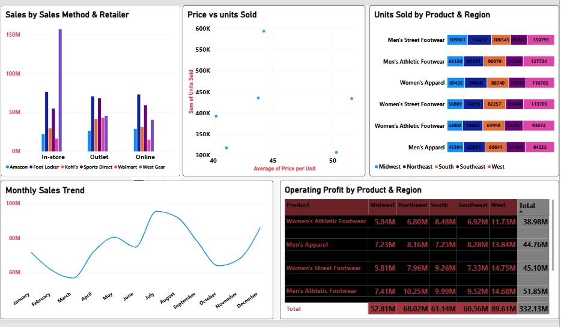

# Adidas Sales Performance & Analytics Dashboard

An interactive Power BI dashboard analyzing $899.90M in Adidas sales across product categories, retailers, regions, and sales channels — built to help stakeholders spot top and bottom performers at a glance, without digging through raw tables.





## Business problem

Adidas leadership needed a way to quickly answer three recurring questions:
- Which product categories, retailers, and regions are driving revenue — and which are lagging?
- How does performance vary by sales channel (in-store, online, outlet)?
- Is there a relationship between pricing and volume that could inform pricing strategy?

Static spreadsheet reports made these comparisons slow and easy to misread. The goal was a self-serve dashboard where any of these questions could be answered in seconds.

## Approach

**Data modeling & DAX**
Built a set of reusable DAX measures that dynamically identify the highest and lowest performer in any given chart, and return a color accordingly:

```dax
Region Bar Color =
VAR CurrentValue = SUM('Table'[Total Sales])
VAR MaxValue = MAXX(ALLSELECTED('Table'[Region]), CALCULATE(SUM('Table'[Total Sales])))
VAR MinValue = MINX(ALLSELECTED('Table'[Region]), CALCULATE(SUM('Table'[Total Sales])))
RETURN
SWITCH(
    TRUE(),
    CurrentValue = MaxValue, "#2ECC71",
    CurrentValue = MinValue, "#E74C3C",
    "#4472C4"
)
```

This pattern was reused across three charts (Region, Retailer, Product Category) via Field Value conditional formatting, so the best and worst performer are always visually obvious — no manual highlighting, no re-reading numbers.

**Dashboard structure**
- **Page 1 — Executive Overview:** KPI cards (Total Sales, Operating Profit, Units Sold, Operating Margin), plus ranked breakdowns by Product Category, Retailer, and Region.
- **Page 2 — Deeper Analysis:** Sales by Sales Method & Retailer, a Price vs. Units Sold scatter plot, Units Sold by Product & Region, Monthly Sales Trend, and an Operating Profit matrix by Product & Region.

**Data quality fixes**
Along the way, caught and corrected two data issues that would have led to misleading conclusions:
- An axis formatting bug was displaying values as "0M%" instead of correct dollar figures.
- The Price vs. Units Sold scatter was summing "Price per Unit" across all transactions instead of averaging it — a subtle error that would have made the x-axis meaningless. Corrected to Average, which revealed a real pricing/volume relationship.

## Key insights

- **West is the strongest region** ($270M), outselling the lowest region (Midwest, $136M) by roughly 2×.
- **West Gear is the top retailer** ($243M), while Walmart trails at $75M — a 3× spread worth investigating from a partnership/allocation perspective.
- **Men's Street Footwear leads all product categories** ($209M), while Women's Athletic Footwear is the lowest performer ($107M).
- **Sales are seasonal**, with a dip around March–April and a strong peak in August–September — useful for inventory and marketing timing.
- **Average price per unit clusters around $44–46** for the highest-volume segment, with one notable outlier near $50 showing much lower volume — a potential pricing sweet-spot signal.

## Tools used

Power BI Desktop · DAX · Power Query

## What I'd do with more time

- Add drill-through pages from the region/retailer charts into transaction-level detail.
- Investigate the Walmart/Amazon underperformance with a dedicated retailer deep-dive page.
- Layer in a forecast for the next two quarters based on the seasonal pattern observed.

---
*Note: dataset used is a training/capstone dataset, not real Adidas financials.*
